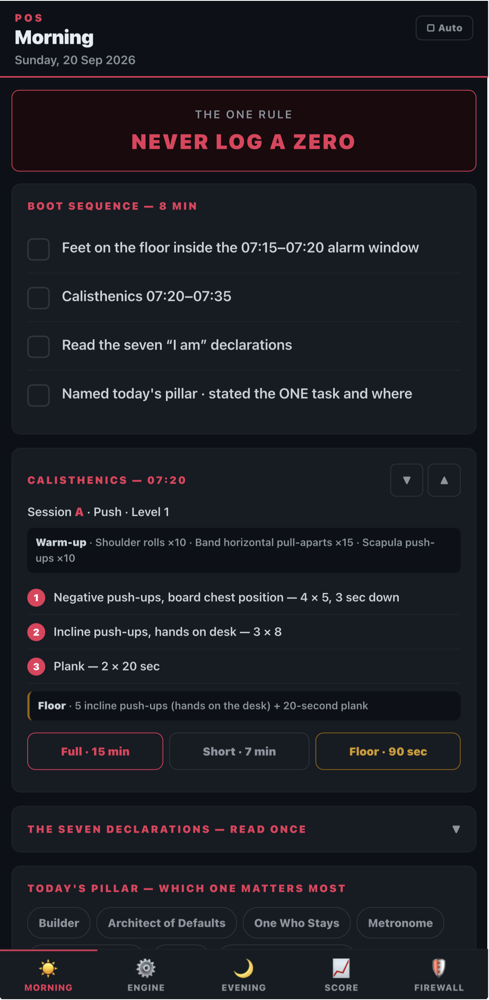
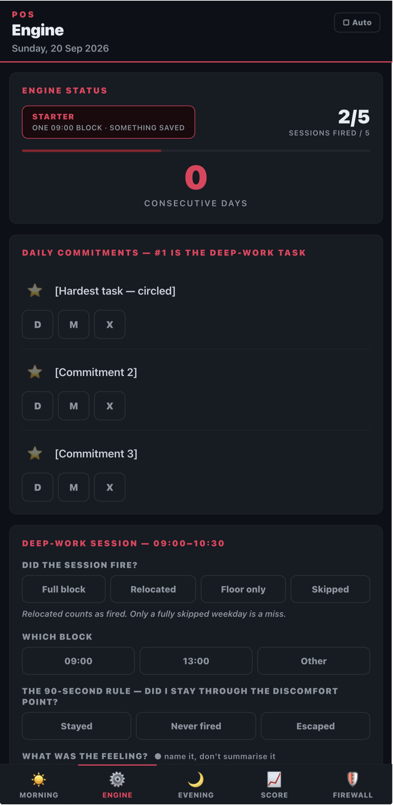
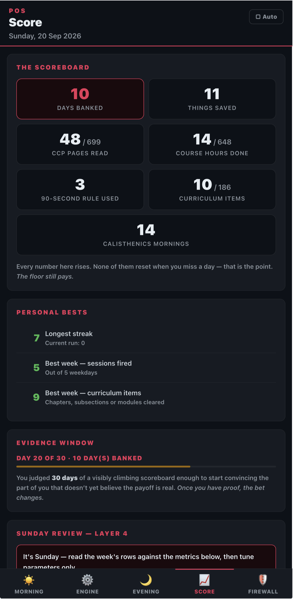
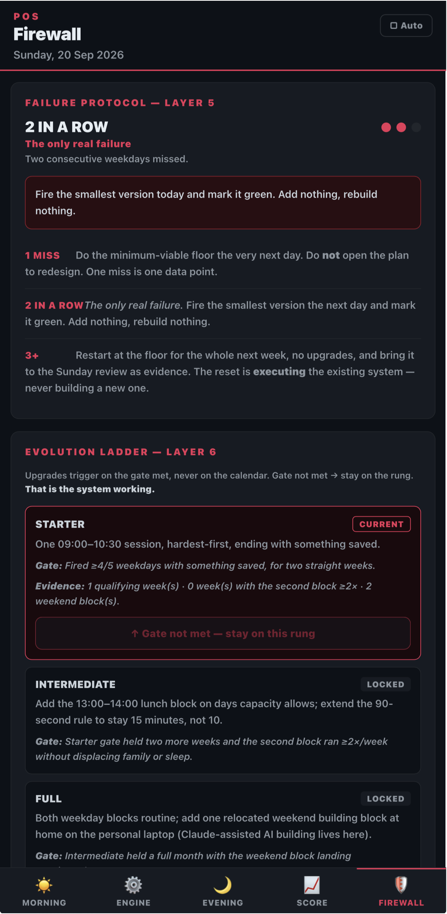
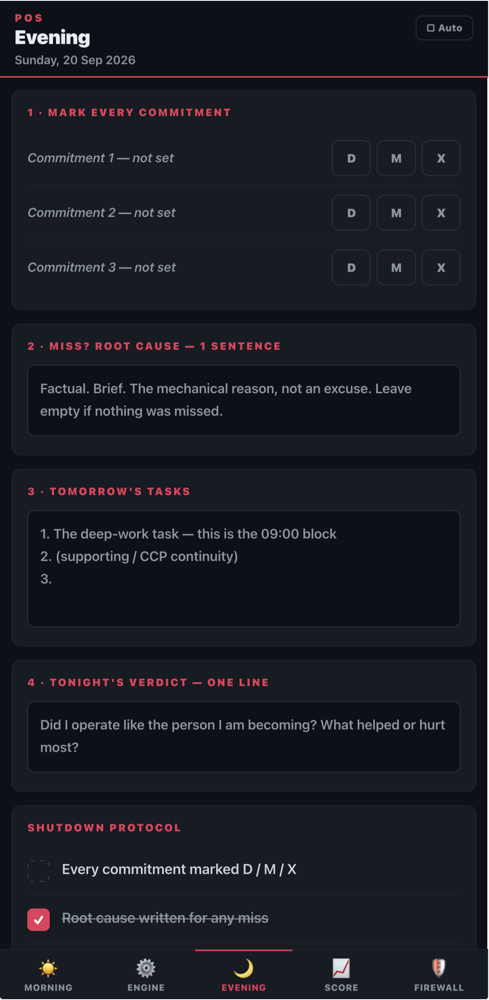

# The Operator

A daily accountability system a Google Apps Script web app backed by Google Sheets, with a single-file offline-capable frontend that runs as a home-screen app on iOS.

I built it for myself and I use it every day. This repository is a sanitised snapshot: the mechanism in full, with my own content replaced by neutral examples.

> **Why it exists.** Long-horizon goals  a certification, a career change pay nothing tonight. Short-horizon alternatives pay immediately, which is why they win. The design goal was a scoreboard that pays for effort *today*, including a reduced "floor" version that still pays on a bad day. Every counter in the app is cumulative and none of them reset when you miss.

<table>
  <tr>
    <td width="33%"></td>
    <td width="33%"></td>
    <td width="33%"></td>
  </tr>
  <tr>
    <td align="center"><sub><b>Morning</b> — the boot sequence, and an exercise session the app picks for you</sub></td>
    <td align="center"><sub><b>Engine</b> — the day's commitments and the deep-work session record</sub></td>
    <td align="center"><sub><b>Score</b> — cumulative counters; none of them reset on a missed day</sub></td>
  </tr>
</table>

---

## What it does

| | |
|---|---|
| **Deep-work session** | Records whether the day's single focused block fired, which slot it used, whether the 90-second discomfort rule was used, and what was *saved* — the completion signal is an artefact, not a feeling or a duration. |
| **Commitments** | Three per day, scored Done / Minimum / Miss. A "minimum" day is a deliberate win, not a partial failure. |
| **Curriculum** | A checklist of every chapter and module across four study tracks, with progress in pages or hours, and one tap to make the next item tomorrow's task. |
| **Scoreboard** | Six cumulative counters plus personal bests. Nothing here can go down. |
| **Weekly metrics** | Three "it's working" and three "it's breaking" signals computed from the log, plus a performance-gated progression ladder that advances on evidence rather than on the calendar. |
| **Reminders** | Two time-driven emails; the evening one suppresses itself if the day is already closed out. |

<table>
  <tr>
    <td width="42%"></td>
    <td valign="top">
      <br>
      <b>Failure is a state the system has a plan for, not an exception.</b>
      <br><br>
      The protocol reads the log and reports how many consecutive weekdays have been missed, then prescribes the response: one miss is a data point, two in a row is the only real failure, three or more triggers a week at the reduced floor. The instruction it shows is always <i>execute something smaller</i> — never <i>redesign the system</i>, which is the failure mode it exists to prevent.
      <br><br>
      Below it, the progression ladder advances only when a performance gate computed from the log is met. It shows the evidence it is judging against, and it stays locked when the gate is not met. There is no way to advance it by hand.
      <br><br>
      <sub>This screenshot is real state, not a mock — two missed weekdays, gate not met.</sub>
    </td>
  </tr>
</table>

---

## Architecture

```
Google Sheets  ←→  Apps Script (V8)  ──HtmlService──▶  single-file SPA
  Log: 25 cols        gas_Code.js                       Index.html
  Curriculum          curriculum_Code.js                 (HTML+CSS+JS, no build)
```

No framework, no bundler, no npm. Apps Script serves one HTML file; every interaction is client-side. `google.script.run` is callback-based with no Promise support, so all server calls are explicit success/failure pairs.

### Decisions worth explaining

**The day's row is built incrementally, not written once.** The morning boot, the deep-work session and the exercise log each land hours apart, and any of them may be the first to create the row. Each partial saver creates today's row if it is missing but leaves the `Level` column blank; `_alreadySavedToday()` treats a blank `Level` as *"day still open"*. That single convention is what keeps the 9 PM reminder firing after a morning entry already exists, without a separate state flag.

**Schema migrations happen in place and never touch data.** `_ensureColumns()` runs on every sheet access: it widens the sheet if the header list has grown and rewrites the header row if it has drifted. Existing rows are never rewritten. New columns are appended rather than inserted beside related ones, specifically so that a partially-migrated sheet cannot shift data in the columns after them.

**Retired fields go blank; they are never removed.** Columns removed from the UI keep their place in the schema so that historical rows still render in full. The schema is append-only by policy.

**Offline-first on the phone.** The curriculum is mirrored to `localStorage` and painted from cache before the round-trip resolves, so the app is never blank on a slow connection and still shows something useful with none at all. Writes are optimistic and reconcile against the server; a failed write reloads rather than leaving a comfortable lie on screen.

**Large payloads load lazily.** The full item breakdown runs to several hundred rows. It is fetched per-module on demand rather than riding along on every curriculum load.

**Seeders are idempotent.** `_seedTrack()` refuses to run if the track already has rows, and a second body appended to an existing track must declare the sequence number it starts at — it is rejected if the track does not already hold exactly that many rows. Re-running a seeder can't duplicate a syllabus or misalign the item-store keys.

**Derived state over recorded state.** Four of the five evening checklist items aren't tappable: they compute from whether the work they describe is actually present. A checklist that can be ticked regardless of what happened records nothing.

---

## The part I'd most want reviewed

After running the app for two weeks I could tell it was costing me around twenty minutes a night, but not *which part*. So instead of redesigning from intuition, I profiled my own logged data field by field.

The log answered it precisely. "Where I stopped" and tomorrow's first task were **the same sentence typed twice on 9 days out of 9**. Four separate reflection fields were holding one thought. The evening checklist read **5/5 on every single logged day**, so it measured nothing. One field had been typed daily and **persisted nowhere** — a real bug, invisible until the data was counted. Another was always identical to a value the app already had.

The result was a subtraction, not a feature: six tabs to five, one evening pass with one save, tomorrow's first line seeded from where today stopped, and the checklist rebuilt to derive itself. No sheet column was added, removed or moved.

The habit I took from it: when a tool feels wrong, measure how it's actually used before changing it. The instinct to redesign is usually stronger than the evidence for it.

<table>
  <tr>
    <td valign="top">
      <br>
      <b>What it became.</b> One pass, top to bottom, one save.
      <br><br>
      The three commitments are marked in the same place they're reviewed. The root-cause box is only relevant when something was missed. Tomorrow's first line is seeded from where today stopped, because that was being retyped by hand every night.
      <br><br>
      The shutdown checklist underneath is the part I'd point at: four of its five items aren't tappable. They derive from whether the work they describe is actually present, so the list shows what's still <i>missing</i> rather than what you're willing to tick. The one remaining tap is for something the app genuinely can't observe.
    </td>
    <td width="42%"></td>
  </tr>
</table>

---

## Testing

No framework. Both harnesses read the real `Index.html` and extract the actual functions by brace-matching, so a test cannot quietly drift from the code it covers.

```bash
node tests/verify.js       # structural
node tests/flow.test.js    # behavioural
```

`verify.js` guards what a single-file frontend makes easy to break: every `getElementById` must resolve to markup that exists, every inline `onclick` must name a defined function, divs and CSS braces must balance. It also enforces an accessibility floor — no informational text below 13px, no low-contrast greys, and `maximum-scale` must stay out of the viewport tag so pinch-zoom keeps working.

`flow.test.js` stubs `localStorage` and a minimal DOM, freezes the clock, and covers the daily logic: the derived checks, the seeding of tomorrow from today's stop point, and the single shared definition of "an active day" used by the streak, the scoreboard and the failure protocol.

---

## Running it

1. Create a Google Sheet named `The Operator Log`. The script finds it by name on first run and caches its id in Script Properties; it creates the tabs and headers itself.
2. `cp .clasp.json.example .clasp.json` and fill in your Apps Script id.
3. Set `MY_EMAIL` and `WAR_MAP_ID` at the top of `gas_Code.js`.
4. `clasp push --force`, then deploy as a web app.
5. Run `getSheet` once from the editor so the schema is created before first use, and run the `seedCurriculum*` functions once each to populate the checklist.

**One deployment gotcha, learned the hard way:** in clasp v3, `deploy` mints a *new* URL while `redeploy` updates an existing one. Deploying when you meant to redeploy leaves your bookmark on the old version with no error and no visible symptom — the app simply stops updating.

---

## Stack

Google Apps Script (V8) · Google Sheets as datastore · HTML/CSS/vanilla JS, ES5-compatible · `clasp` · Node for tests

## Licence

MIT — see [LICENSE](LICENSE).
